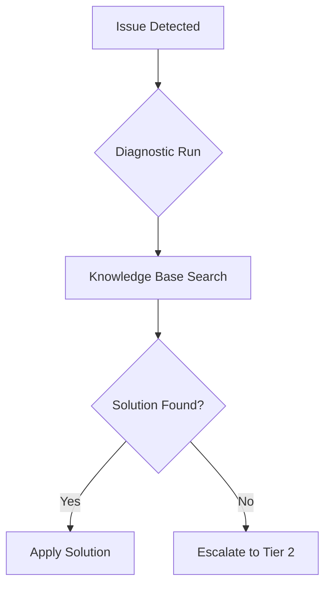
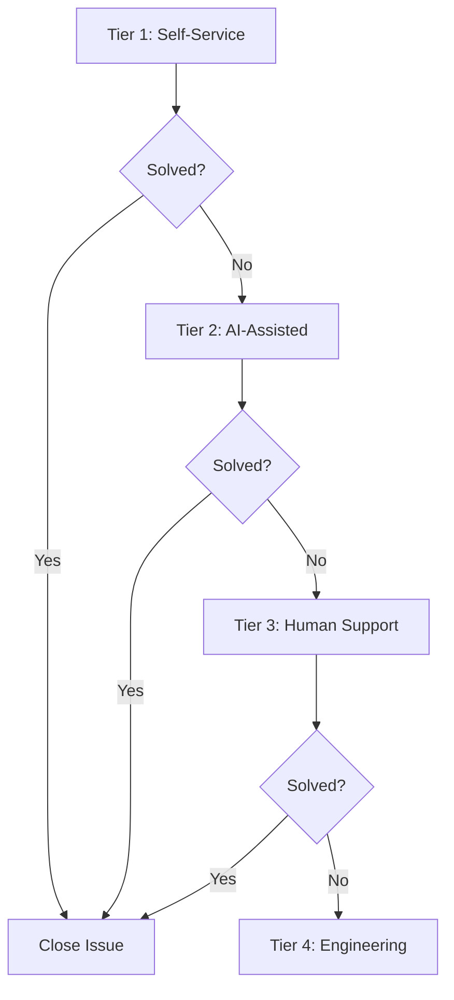

# DevContainer Support Escalation Workflows

This directory contains automated escalation workflows that route DevContainer issues to appropriate support channels based on severity, user context, and solution effectiveness.

## Escalation Tiers

### Tier 1: Self-Service (Automated)
- **Trigger**: Initial issue detection
- **Response**: Knowledge base search, automated fixes
- **Resolution Time**: Immediate to 5 minutes
- **Success Rate Target**: 80%

### Tier 2: AI-Assisted Support
- **Trigger**: Self-service solutions insufficient
- **Response**: Interactive AI troubleshooting, guided solutions
- **Resolution Time**: 5-30 minutes
- **Success Rate Target**: 90%

### Tier 3: Human Support
- **Trigger**: AI-assisted support unsuccessful
- **Response**: Live human assistance, code review, environment analysis
- **Resolution Time**: 30 minutes to 4 hours
- **Success Rate Target**: 95%

### Tier 4: Engineering Escalation
- **Trigger**: Complex issues requiring code changes or architectural decisions
- **Response**: Development team involvement, feature requests, bug fixes
- **Resolution Time**: 4 hours to 2 days
- **Success Rate Target**: 98%

## Automated Escalation Logic

### Issue Classification

Issues are automatically classified based on:

```typescript
interface IssueClassification {
  severity: 'critical' | 'high' | 'medium' | 'low';
  category: string;
  complexity: 'simple' | 'moderate' | 'complex';
  userExperience: 'beginner' | 'intermediate' | 'advanced';
  businessImpact: 'low' | 'medium' | 'high';
  estimatedResolutionTime: number;
}
```

### Escalation Rules

```yaml
# Critical Issues - Immediate Escalation
- condition: severity == 'critical'
  action: escalate_to_tier_3
  priority: urgent
  notification: all_channels

# High Complexity Issues
- condition: complexity == 'complex' AND user_attempts > 3
  action: escalate_to_tier_3
  priority: high

# Business Impact Issues
- condition: business_impact == 'high' AND resolution_time > 60
  action: escalate_to_tier_4
  priority: urgent

# Repeated Issues
- condition: same_issue_reported > 5_times_in_24h
  action: escalate_to_tier_4
  priority: high
  reason: potential_systemic_issue
```

## Support Channel Integration

### Communication Channels

#### Slack Integration
- **Channel**: `#devcontainer-support`
- **Bot Integration**: Automated issue notifications and status updates
- **Interactive Support**: Real-time assistance via Slack threads

#### GitHub Issues
- **Repository**: `GNUS-DAO/devcontainer-support`
- **Automated Creation**: Issues created when escalation occurs
- **Template Integration**: Pre-filled issue templates with diagnostic data

#### Email Notifications
- **Distribution**: Support team and stakeholders
- **Templates**: Formatted escalation notifications with context
- **Updates**: Resolution status and follow-up communications

### External Support Systems

#### Help Desk Integration
- **ServiceNow**: Enterprise ticketing system
- **Jira Service Desk**: Development team coordination
- **Zendesk**: Customer-facing support portal

## Escalation Workflow

### 1. Issue Detection



### 2. Tier Progression



### 3. Resolution Tracking

```typescript
interface EscalationRecord {
  issueId: string;
  userId: string;
  initialTier: number;
  currentTier: number;
  escalationTime: Date;
  resolutionTime?: Date;
  resolutionTier: number;
  satisfactionScore?: number;
  lessonsLearned: string[];
}
```

## Automated Actions

### Tier 1 Actions
- Run diagnostic suite
- Search knowledge base
- Apply automated fixes
- Provide self-service resources

### Tier 2 Actions
- Interactive troubleshooting
- Guided solution walkthrough
- Code review suggestions
- Environment analysis

### Tier 3 Actions
- Human expert assignment
- Screen sharing sessions
- Code pair programming
- Environment deep dive

### Tier 4 Actions
- Development team involvement
- Code changes and patches
- Documentation updates
- Process improvements

## Analytics and Reporting

### Escalation Metrics

```typescript
interface EscalationMetrics {
  totalEscalations: number;
  averageResolutionTime: number;
  tierDistribution: Record<number, number>;
  successRatesByTier: Record<number, number>;
  commonEscalationReasons: string[];
  userSatisfactionByTier: Record<number, number>;
}
```

### Reporting Dashboard

- **Real-time Metrics**: Current escalation status and queue lengths
- **Trend Analysis**: Escalation patterns and resolution improvements
- **User Experience**: Satisfaction scores and feedback analysis
- **Efficiency Metrics**: Time to resolution and cost analysis

## Quality Assurance

### Escalation Accuracy
- **False Positives**: Minimize incorrect escalations
- **False Negatives**: Ensure critical issues are escalated
- **Timing**: Appropriate escalation timing based on issue severity

### Support Quality
- **First Contact Resolution**: Track resolution at each tier
- **User Satisfaction**: Regular feedback collection
- **Knowledge Base Updates**: Learn from escalations to improve self-service

## Integration Points

### Diagnostic Tools
- **Automated Analysis**: Diagnostic results trigger appropriate escalations
- **Context Preservation**: Full diagnostic context carried through escalation
- **Solution Tracking**: Track which solutions were attempted before escalation

### Knowledge Base
- **Gap Identification**: Missing solutions identified through escalations
- **Content Improvement**: User feedback drives knowledge base updates
- **Effectiveness Tracking**: Measure solution success rates

### Feedback System
- **Satisfaction Tracking**: User satisfaction measured at each tier
- **Improvement Suggestions**: Feedback drives system improvements
- **Trend Analysis**: Identify systemic issues and improvement opportunities

## Emergency Procedures

### Critical Issue Protocol
1. **Immediate Notification**: All stakeholders notified within 5 minutes
2. **Rapid Response Team**: Specialized team assembled for critical issues
3. **Communication Plan**: Regular updates provided to affected users
4. **Post-Mortem**: Detailed analysis conducted after resolution

### System Outage Response
1. **Status Page Updates**: Public communication of system status
2. **Alternative Solutions**: Provide workarounds during outages
3. **Rollback Procedures**: Ability to revert to previous working state
4. **Recovery Planning**: Detailed recovery procedures and testing

## Continuous Improvement

### Feedback Loop
- **User Input**: Regular collection of user feedback and suggestions
- **Performance Monitoring**: Track system performance and identify bottlenecks
- **Process Optimization**: Regular review and optimization of escalation processes
- **Technology Updates**: Keep escalation tools and integrations current

### Training and Development
- **Support Team Training**: Regular training on new tools and processes
- **Process Documentation**: Keep escalation procedures current and accessible
- **Cross-Training**: Ensure multiple team members can handle each tier
- **Certification Programs**: Formal certification for support team members

---

*This escalation system ensures that DevContainer users receive appropriate support at the right time, maximizing resolution efficiency while maintaining high user satisfaction.*